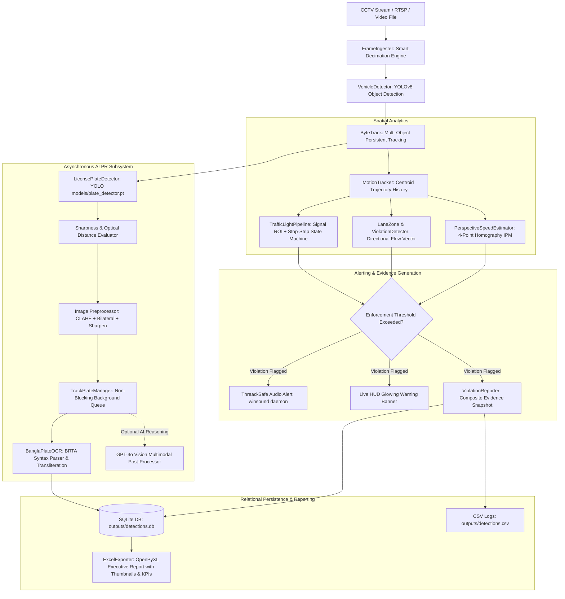

# 🚦 Bangladeshi Highway Traffic Surveillance & Automated License Plate Recognition (ALPR) System

[](https://www.python.org/)
[](https://github.com/ultralytics/ultralytics)
[](https://github.com/roboflow/supervision)
[](https://github.com/JaidedAI/EasyOCR)
[](https://platform.openai.com/)
[](LICENSE)

An enterprise-grade, high-performance Computer Vision and Intelligent Transportation System (ITS) pipeline engineered specifically for roadway surveillance and traffic enforcement in Bangladesh. 

The system unifies real-time vehicle detection and persistent multi-object tracking, specialized Bengali license plate localization and character recognition (ALPR), calibrated Inverse Perspective Mapping (IPM) speed measurement, directional lane discipline and wrong-way enforcement, red-light stop-line crossing monitoring, non-blocking audio/HUD alerts, and automated executive Excel reporting with embedded visual thumbnails.

> 📘 **Deep Architectural Reference**: For mathematical homography formulations, pixel-to-meter matrices, and detailed architectural state machines, refer to [SYSTEM_ARCHITECTURE_AND_SETUP.md](file:///d:/traffic-automation/SYSTEM_ARCHITECTURE_AND_SETUP.md).

---

## 📑 Table of Contents

- [Key Capabilities](#-key-capabilities)
- [System Architecture & Data Flow](#-system-architecture--data-flow)
- [Repository File Inventory](#-repository-file-inventory)
- [Installation & Environment Setup](#-installation--environment-setup)
- [How to Run (CLI Guide)](#-how-to-run-cli-guide)
  - [1. Master CLI Orchestrator (`main.py`)](#1-master-cli-orchestrator-mainpy)
  - [2. Standalone Dedicated Modules](#2-standalone-dedicated-modules)
  - [3. CLI Flags & Options Reference](#3-cli-flags--options-reference)
- [Core Subsystem Mechanics](#-core-subsystem-mechanics)
  - [A. Smart Frame Decimation Engine](#a-smart-frame-decimation-engine)
  - [B. Calibrated IPM Speed Measurement](#b-calibrated-ipm-speed-measurement)
  - [C. Directional Lane & Wrong-Way Enforcement](#c-directional-lane--wrong-way-enforcement)
  - [D. License Plate Harvesting & Bengali OCR](#d-license-plate-harvesting--bengali-ocr)
  - [E. Traffic Light Stop-Strip Violation](#e-traffic-light-stop-strip-violation)
  - [F. Thread-Safe Audio Alerts & HUD](#f-thread-safe-audio-alerts--hud)
- [Configuration Reference (`config.yaml`)](#-configuration-reference-configyaml)
- [Data Storage & Relational Outputs](#-data-storage--relational-outputs)
  - [1. SQLite Relational Database (`outputs/detections.db`)](#1-sqlite-relational-database-outputsdetectionsdb)
  - [2. Executive Excel Audit Workbook (`outputs/traffic_violations_alpr.xlsx`)](#2-executive-excel-audit-workbook-outputstraffic_violations_alprxlsx)
  - [3. CSV Logs & Visual Snapshots](#3-csv-logs--visual-snapshots)
- [Camera Calibration & Customization](#-camera-calibration--customization)
- [Troubleshooting & Developer FAQ](#-troubleshooting--developer-faq)

---

## 🌟 Key Capabilities

1. **Unified Multi-Task Orchestration**:
   - Master orchestrator [main.py](file:///d:/traffic-automation/main.py) provides a single unified entry point across all surveillance modules (`all`, `lane`, `speed`, `plate`, `traffic_light`, `excel`).
   - Every subtask also retains its own dedicated standalone script for isolated debugging, microservice deployment, or automated batch jobs.

2. **Vehicle Detection & Multi-Object Tracking**:
   - YOLOv8 network optimized for Bangladeshi vehicular classes: cars, motorbikes, auto-rickshaws, buses, and trucks.
   - ByteTrack multi-object tracker ensuring persistent track IDs across dense roadway conditions, occlusions, and variable camera elevations.

3. **Bangladeshi Number Plate Recognition (ALPR / ANPR)**:
   - Dedicated YOLO plate detector ([models/plate_detector.pt](file:///d:/traffic-automation/models/plate_detector.pt)) localized to BRTA standard plate dimensions.
   - Dynamic sharpness and resolution scoring: tracks each vehicle through its trajectory and harvests plate crops at the optimal optical moment rather than capturing blurry horizon images.
   - Deep image pre-processing: CLAHE contrast normalization in LAB space, bilateral noise reduction, bicubic upscaling, and unsharp masking.
   - Non-blocking background worker thread ([TrackPlateManager](file:///d:/traffic-automation/src/plate_detector.py#L484)) eliminating video lag and stutter during deep neural OCR.
   - Specialized Bengali OCR with BRTA syntax validation (Metro names: ঢাকা, চট্টগ্রাম, সিলেট, etc.; vehicle class letters: ক, খ, গ, ঘ, চ, ছ; and Bengali digits ০-৯) with automatic English transliteration.
   - Multimodal OpenAI GPT-4o Vision reasoning module for damaged, faded, or embossed plates.

4. **Calibrated Perspective (IPM) Speed Measurement**:
   - 4-point Inverse Perspective Mapping (IPM) homography transformation mapping camera pixels into metric ground coordinates ($m/s \to km/h$).
   - Perspective horizon cutoff ($y < 260$) eliminating mathematical false spikes from distant vehicles.
   - Rolling median velocity smoothing and configurable grace tolerances (e.g., 60 km/h limit + 5 km/h tolerance = 65 km/h enforcement threshold).
   - Dynamic resolution auto-scaling preserving metric calibration regardless of whether the source stream is 720p, 1080p, or 4K.

5. **Lane Discipline & Wrong-Way Enforcement**:
   - 4-point directional lane zone ([LaneZone](file:///d:/traffic-automation/src/lane_zone.py#L21)) with normalized entry-to-exit progress vectors.
   - Instant detection of vehicles traveling against legal traffic flow or illegally entering from forbidden exit boundaries.

6. **Traffic Light Stop-Strip Violation**:
   - Signal state classifier using polygon Region of Interest (ROI) HSV/RGB color analysis to determine active light status (Red, Yellow, Green).
   - Virtual stop-strip intersection state machine detecting vehicles entering or crossing the stop line specifically during active red signal phases.

7. **Executive Reporting & Live Evidence**:
   - On-screen Picture-in-Picture (PiP) plate preview with bilingual on-screen HUD.
   - Thread-safe, non-blocking audio alerts (`winsound.Beep` daemon on Windows, terminal bell fallback on Linux).
   - High-resolution vehicle composite evidence snapshots featuring an inset zoomed license plate crop and bilingual information badge.
   - Production Excel audit report ([src/excel_exporter.py](file:///d:/traffic-automation/src/excel_exporter.py)) with KPI summary cards, 18 relational data columns, conditional formatting, and embedded visual thumbnails.
   - Synchronized dual persistence to CSV and relational SQLite ([outputs/detections.db](file:///d:/traffic-automation/outputs/detections.db)).

---

## 🏗️ System Architecture & Data Flow



---

## 📁 Repository File Inventory

### Root Scripts & Execution Modules
| File | Role & Description |
| :--- | :--- |
| [main.py](file:///d:/traffic-automation/main.py) | **Master CLI Orchestrator**: Central entry point to execute the full unified pipeline or any subtask using the `--mode` flag. |
| [plate_speed_pipeline.py](file:///d:/traffic-automation/plate_speed_pipeline.py) | **Unified Pipeline Engine**: Comprehensive multi-task runner orchestrating speed estimation, lane enforcement, asynchronous ALPR, live HUD, and automatic Excel export. |
| [wrong_lane_violation.py](file:///d:/traffic-automation/wrong_lane_violation.py) | **Standalone Lane Enforcement**: Dedicated pipeline for directional vector analysis, wrong-way detection, and illegal lane entry enforcement. |
| [speed_violation.py](file:///d:/traffic-automation/speed_violation.py) | **Standalone IPM Speed Estimator**: Dedicated pipeline for camera-calibrated homography speed measurement and speeding infraction logging. |
| [license_plate_capture.py](file:///d:/traffic-automation/license_plate_capture.py) | **Standalone ALPR Harvester**: Dedicated pipeline for vehicle plate detection, sharpness-based best-crop selection, and asynchronous OCR. |
| [traffic_light_violation.py](file:///d:/traffic-automation/traffic_light_violation.py) | **Standalone Traffic Light Enforcement**: Dedicated pipeline for signal ROI color classification and virtual stop-line strip crossing violation. |
| [export_excel.py](file:///d:/traffic-automation/export_excel.py) | **Standalone Excel Generator**: CLI utility to generate the master executive Excel audit workbook from SQLite records and harvested plate crops. |
| [process_crops.py](file:///d:/traffic-automation/process_crops.py) | **Plate Post-Processing Engine**: Scans harvested plate crops, applies multi-scale OCR, updates SQLite, and triggers Excel export with optional GPT-4o Vision reasoning. |
| [pipeline.py](file:///d:/traffic-automation/pipeline.py) | **Backward Compatibility Alias**: Compatibility shim forwarding legacy invocations to `wrong_lane_violation.py`. |
| [config.yaml](file:///d:/traffic-automation/config.yaml) | **Master Configuration**: Centralized YAML settings for all model paths, camera polygons, thresholds, decimation, and visual/audio options. |
| [requirements.txt](file:///d:/traffic-automation/requirements.txt) | **Dependencies**: Required Python libraries and framework versions. |

### Source Package (`src/`)
| Module | Role & Core Components |
| :--- | :--- |
| [src/tracker.py](file:///d:/traffic-automation/src/tracker.py) | `VehicleDetector` (YOLOv8 inference wrapper) and ByteTrack tracker initialization. |
| [src/motion_tracker.py](file:///d:/traffic-automation/src/motion_tracker.py) | `MotionTracker`: Maintains vehicle centroid history, calculates smoothed displacement vectors, and manages track lifecycle. |
| [src/lane_zone.py](file:///d:/traffic-automation/src/lane_zone.py) | `LaneZone`: 4-point quadrilateral polygon geometry, directional unit vectors, entry/exit boundary projections, and resolution auto-scaling. |
| [src/violation_detector.py](file:///d:/traffic-automation/src/violation_detector.py) | `ViolationDetector`: Directional cosine similarity, opposite-direction thresholding, and forbidden boundary entry enforcement. |
| [src/speed_estimator.py](file:///d:/traffic-automation/src/speed_estimator.py) | `PerspectiveSpeedEstimator`: 4-point planar homography ($3 \times 3$ matrix) mapping image pixels to metric ground meters, rolling median velocity smoothing, and horizon clipping. |
| [src/plate_detector.py](file:///d:/traffic-automation/src/plate_detector.py) | `LicensePlateDetector`, `BanglaPlateOCR` (BRTA syntax matching, city/class regex, English transliteration), and `TrackPlateManager` (asynchronous worker thread for non-blocking neural OCR). |
| [src/violation_reporter.py](file:///d:/traffic-automation/src/violation_reporter.py) | `ViolationReporter`: High-resolution composite evidence snapshot generator with plate zoom inset badge, CSV logger, and SQLite database writer. |
| [src/excel_exporter.py](file:///d:/traffic-automation/src/excel_exporter.py) | `ExcelViolationExporter`: OpenPyXL workbook generator creating executive KPI cards, 18 relational data columns, conditional formatting, and embedded image thumbnails. |
| [src/gpt_plate_reader.py](file:///d:/traffic-automation/src/gpt_plate_reader.py) | `GPTPlateReader`: Multimodal OpenAI GPT-4o Vision extractor for complex, degraded, or embossed license plates. |
| [src/utils.py](file:///d:/traffic-automation/src/utils.py) | `FrameIngester` (smart frame decimation), `FPSCounter`, `draw_hud`, `draw_tracked_vehicle`, `BilingualDrawer` (PIL fallback for Bengali Unicode rendering), and `trigger_beep` (thread-safe audio alerts). |

### Models & Assets (`models/`)
| Path | Contents & Specifications |
| :--- | :--- |
| [models/plate_detector.pt](file:///d:/traffic-automation/models/plate_detector.pt) | Custom YOLOv8 license plate detector trained on Bangladeshi vehicle plates. |
| [models/EasyOCR/user_network/](file:///d:/traffic-automation/models/EasyOCR/user_network) | Custom PyTorch model definition (`bn_license_tps.py`) and character dictionary (`bn_license_tps.yaml`) for specialized BRTA recognition. |
| `yolov8n.pt` | Ultralytics YOLOv8 nano model for general vehicle localization. |

---

## 🚀 Installation & Environment Setup

### Prerequisites
* **Operating System**: Windows 10/11 or Linux (Ubuntu 20.04+ recommended)
* **Python**: Version 3.10 or higher
* **Hardware**: Dedicated NVIDIA GPU with CUDA support recommended for real-time EasyOCR inference (CPU mode is supported automatically as a fallback).

### 1. Clone & Set Up Virtual Environment

```powershell
# Clone the repository
git clone https://github.com/your-org/traffic-automation.git
cd traffic-automation

# Create virtual environment
python -m venv .venv

# Activate virtual environment
# On Windows (PowerShell):
.\.venv\Scripts\Activate.ps1

# On Windows (Command Prompt):
.\.venv\Scripts\activate.bat

# On Linux / macOS:
source .venv/bin/activate
```

### 2. Install Core Dependencies

```bash
# Upgrade pip and install required packages
python -m pip install --upgrade pip
pip install -r requirements.txt
```

> 💡 **Optional: OpenAI Vision API**: If you plan to use GPT-4o Vision multimodal post-processing for degraded plates, install the OpenAI package:
> ```bash
> pip install openai
> ```

### 3. Bengali Font Support (Windows / Linux)
The system renders bilingual on-screen text (Bangla + English) onto snapshots and preview HUDs:
* **Windows**: The pipeline automatically detects installed system fonts such as `vrinda.ttf` or `kalpurush.ttf`.
* **Linux**: Install standard Bengali fonts via `sudo apt-get install fonts-bengali`.
* If no Bengali font is installed on the host OS, the pipeline automatically falls back to clean standardized English transliteration without crashing.

---

## 💻 How to Run (CLI Guide)

[main.py](file:///d:/traffic-automation/main.py) is the master command-line orchestrator. Run any task by setting `--mode`.

### 1. Master CLI Orchestrator (`main.py`)

#### A. Master Unified Pipeline (`--mode all`)
Runs vehicle detection, ByteTrack tracking, IPM speed estimation, wrong-way detection, asynchronous license plate harvesting, live HUD preview, and automatically generates an executive Excel report at completion:

```bash
# Run on default benchmark video (cctv_footage.mp4)
python main.py --mode all

# Run on a custom video file or stream
python main.py path/to/video.mp4 --mode all

# Headless mode for server / background execution (no GUI window)
python main.py cctv_footage.mp4 --mode all --no-display

# Process only first 500 frames for quick testing
python main.py cctv_footage.mp4 --mode all --max-frames 500 --no-display
```

#### B. Dedicated Lane Discipline Only (`--mode lane`)
```bash
python main.py cctv_footage.mp4 --mode lane
```

#### C. Dedicated IPM Speed Estimation Only (`--mode speed`)
```bash
python main.py cctv_footage.mp4 --mode speed
```

#### D. Dedicated Plate Harvesting & ALPR Only (`--mode plate`)
```bash
python main.py cctv_footage.mp4 --mode plate
```

#### E. Dedicated Traffic Light Enforcement Only (`--mode traffic_light`)
```bash
python main.py light_cut.mp4 --mode traffic_light
```

#### F. Executive Excel Report Generation Only (`--mode excel`)
Generates an executive Excel workbook from existing SQLite database records and harvested snapshots:

```bash
# Offline local EasyOCR post-processing (no API key needed):
python main.py --mode excel --no-gpt

# With OpenAI GPT-4o Vision multimodal analysis:
python main.py --mode excel
# (Requires OPENAI_API_KEY environment variable or config.yaml ai.openai_api_key)
```

---

### 2. Standalone Dedicated Modules

Each surveillance module can also be invoked independently via its dedicated script:

#### A. Lane & Wrong-Way Enforcement
```bash
python wrong_lane_violation.py cctv_footage.mp4
# With headless execution:
python wrong_lane_violation.py cctv_footage.mp4 --no-display
```

#### B. IPM Perspective Speed Estimation
```bash
python speed_violation.py cctv_footage.mp4
# Process first 300 frames:
python speed_violation.py cctv_footage.mp4 --max-frames 300
```

#### C. License Plate Capture & Harvesting
```bash
python license_plate_capture.py cctv_footage.mp4
```

#### D. Traffic Light Violation
```bash
python traffic_light_violation.py light_cut.mp4
# With custom stop-strip width and custom output CSV:
python traffic_light_violation.py light_cut.mp4 --strip-half-width 40 --csv outputs/red_light.csv
```

#### E. Standalone Excel Exporter
```bash
# Offline export (uses local EasyOCR):
python export_excel.py --no-gpt

# Custom database and output location:
python export_excel.py --db outputs/detections.db --output outputs/audit_report.xlsx --no-gpt
```

---

### 3. CLI Flags & Options Reference

| Flag | Applicable Modes | Description | Default |
| :--- | :--- | :--- | :--- |
| `source` | `all`, `lane`, `speed`, `plate`, `traffic_light` | Path to video file, webcam index (`0`), or RTSP stream | `config.yaml input.source` |
| `--mode` | `main.py` | Pipeline execution mode: `all`, `lane`, `speed`, `plate`, `traffic_light`, `excel` | `all` |
| `--config` | All | Path to custom YAML configuration file | `config.yaml` |
| `--no-display` | All video modes | Disable on-screen OpenCV preview window (ideal for headless servers) | `False` |
| `--save-video` | All video modes | Force saving annotated output MP4 video | From config |
| `--no-save-video` | All video modes | Disable saving annotated output MP4 video to conserve disk space | From config |
| `--decimation` | All video modes | Frame decimation factor (`1` = process every frame, `4` = process 1 in 4) | `auto` |
| `--fps` | All video modes | Override source video frame rate | Ingested FPS |
| `--max-frames` | All video modes | Stop processing after $N$ video frames | Full video |
| `--no-gpt` | `excel`, `export_excel.py` | Disable OpenAI GPT-4o Vision API; use local EasyOCR | `False` |
| `--strip-half-width`| `traffic_light` | Half-width (pixels) for virtual stop-line violation strip | `35` |
| `--csv` | All | Override output CSV file path | From config |
| `--snapshots-dir` | All | Override output directory for violation snapshots | `outputs/snapshots` |
| `--annotated-video` | All | Override output annotated video filename | From config |

---

## 🔬 Core Subsystem Mechanics

### A. Smart Frame Decimation Engine
* **The Challenge**: High-resolution CCTV streams (e.g., 2046x1080 @ 60 FPS) overwhelm GPU/CPU pipelines if every frame triggers YOLOv8 and ByteTrack, causing severe pipeline freezing and frame drops.
* **The Solution**: [FrameIngester](file:///d:/traffic-automation/src/utils.py#L320) implements an intelligent `auto` decimation system targeting `target_process_fps: 15`. It calculates:
  $$\text{decimation\_factor} = \max\left(1, \text{round}\left(\frac{\text{source\_fps}}{\text{target\_fps}}\right)\right)$$
  For 60 FPS CCTV, it processes 1 in every 4 frames (effective 15 FPS), preserving smooth ByteTrack motion trajectories while maintaining 100% real-time tracking performance.

### B. Calibrated IPM Speed Measurement
* **The Challenge**: Camera perspective foreshortens the road: a pixel near the horizon represents tens of meters, while a pixel near the bottom represents centimeters. A naive pixels-per-second calculation produces massive errors.
* **The Solution**: [PerspectiveSpeedEstimator](file:///d:/traffic-automation/src/speed_estimator.py#L32) applies a $3 \times 3$ planar homography matrix $H$:
  $$\begin{bmatrix} X_w \\ Y_w \\ 1 \end{bmatrix} \sim H \begin{bmatrix} u \\ v \\ 1 \end{bmatrix}$$
  mapping 4 image polygon vertices to real-world metric road coordinates ($[0, \text{width}] \times [0, \text{length}]$ in meters).
* **Noise Mitigation**:
  - **Horizon Cutoff**: Trajectories with $y < 260$ are filtered out to prevent perspective compression spikes.
  - **Rolling Median Velocity**: Speeds are calculated across a temporal sliding window ($0.5\text{s}$) using median filtering to eliminate camera vibration artifacts.
  - **Tolerance Buffer**: Violations require exceeding $\text{speed\_limit} + \text{speed\_tolerance}$ (e.g., $60 + 5 = 65\text{ km/h}$) sustained over consecutive frames.

### C. Directional Lane & Wrong-Way Enforcement
* **Geometry**: [LaneZone](file:///d:/traffic-automation/src/lane_zone.py#L21) defines a 4-point convex quadrilateral with points ordered:
  - $P_1$: Exit Left, $P_2$: Exit Right, $P_3$: Entry Right, $P_4$: Entry Left.
* **Flow Vector**: The legal direction unit vector $\vec{u}_{\text{legal}}$ points from the entry midpoint to the exit midpoint.
* **Violation Logic**:
  - **Opposite Direction**: When a vehicle's motion displacement vector $\vec{v}$ satisfies:
    $$\cos(\theta) = \frac{\vec{v} \cdot \vec{u}_{\text{legal}}}{\|\vec{v}\| \|\vec{u}_{\text{legal}}\|} < \text{threshold} \quad (\text{typically } < -0.2)$$
  - **Forbidden Exit Entry**: Flags vehicles that first appear entering the zone from the exit boundary ($P_1 \to P_2$).

### D. License Plate Harvesting & Bengali OCR
* **Best Optical Snapshot Selection**: Instead of running OCR on every frame, [LicensePlateDetector](file:///d:/traffic-automation/src/plate_detector.py#L65) scores detections by size and Laplacian variance (sharpness). It tracks the clearest, closest crop for each vehicle track ID.
* **Image Preprocessing**:
  - Dynamic bicubic upscaling to minimum standardized dimensions ($300 \times 120$).
  - Bilateral filtering to smooth road grime while preserving sharp character edges.
  - CLAHE (Contrast Limited Adaptive Histogram Equalization) in LAB color space.
* **Asynchronous Neural Queue**: [TrackPlateManager](file:///d:/traffic-automation/src/plate_detector.py#L484) offloads EasyOCR inference to a background daemon thread. The main video stream never freezes while deep neural networks parse characters.
* **BRTA Syntax Validation**: Parses lines into canonical Bangladesh format:
  $$\text{[Metro/District]} - \text{[Class Letter]} - \text{[Number]}$$
  Example: `ঢাকা মেট্রো-গ ১২-৩৪৫৬` $\to$ `DHAKA METRO-GA 12-3456`.

### E. Traffic Light Stop-Strip Violation
* **Signal State Classifier**: Isolates the traffic signal using a defined polygon ROI. Computes color masks in HSV/RGB color space to determine whether the signal is **RED**, **YELLOW**, or **GREEN**.
* **Virtual Stop-Strip**: Constructs a dilated polygon zone around the road stop line.
* **State Machine**: Tracks vehicle anchors. If a vehicle crosses or enters the stop-strip while the signal state is confirmed **RED**, a red-light violation is instantly logged, snapshot captured, and audio alert triggered.

### F. Thread-Safe Audio Alerts & HUD
* **Audio Alerts**: [trigger_beep](file:///d:/traffic-automation/src/utils.py#L18) runs non-blocking audio generation on a background daemon thread with debouncing (preventing audio queue saturation). Uses native `winsound.Beep` on Windows and falls back to terminal bell on Linux.
* **Live HUD**: Displays real-time FPS, frame index, active track counts, total violation counter, and an on-screen warning banner when infractions occur.

---

## ⚙️ Configuration Reference (`config.yaml`)

All parameters are centralized in [config.yaml](file:///d:/traffic-automation/config.yaml):

```yaml
# Model and artifact paths
paths:
  vehicle_model: "yolov8n.pt"                  # Base vehicle detector
  plate_model: "models/plate_detector.pt"      # License plate detector
  easyocr_models_dir: "models/EasyOCR/models"  # Custom OCR weights
  easyocr_user_network_dir: "models/EasyOCR/user_network"
  output_dir: "outputs"
  csv_log: "outputs/detections.csv"            # Master CSV detection log
  db_log: "outputs/detections.db"              # SQLite relational database
  annotated_video: "outputs/annotated_plate_speed.mp4"

# Video ingestion & decimation
input:
  source: "cctv_footage.mp4"                   # Video file path, webcam (0), or RTSP
  frame_decimation: "auto"                     # "auto" maintains target_process_fps
  target_process_fps: 15                       # Optimal FPS for ByteTrack stability
  force_fps: 0                                 # Override source FPS if 0

# Vehicle detection settings
vehicle_detection:
  confidence_threshold: 0.35
  iou_threshold: 0.45
  target_classes: [2, 3, 5, 7]                  # 2: car, 3: motorbike, 5: bus, 7: truck
  input_size: 640

# ByteTrack parameters
bytetrack:
  track_activation_threshold: 0.35
  lost_track_buffer: "auto"
  minimum_matching_threshold: 0.75
  frame_rate: 30

# Speed measurement (IPM Homography)
speed:
  reference_resolution: [2046, 1080]           # Auto-scales coordinates if video differs
  method: "homography"                         # "homography" or "pixel_ratio"
  speed_limit_kmh: 60.0                        # Legal speed limit
  speed_tolerance_kmh: 5.0                     # Grace tolerance (flags above 65 km/h)
  min_track_frames: 8                          # Minimum frames before evaluating
  min_sustained_frames: 6                      # Consecutive frames required above limit
  min_measurement_y: 260                       # Horizon cutoff to filter perspective spikes
  window_duration_sec: 0.5                     # Sliding window for velocity smoothing
  source_polygon:                              # 4 road points in camera coordinates
    - [750, 180]                               # Top-Left
    - [1350, 180]                              # Top-Right
    - [1850, 980]                              # Bottom-Right
    - [450, 980]                               # Bottom-Left
  ground_width_meters: 8.0                     # Real-world 2-lane roadway width (~8m)
  ground_length_meters: 30.0                   # Real-world stretch distance (~30m)

# Directional lane discipline
lane_zone:
  reference_resolution: [2046, 1080]           # Auto-scales P1..P4
  points:
    - [280, 950]                               # P1: Exit Left
    - [2000, 950]                              # P2: Exit Right
    - [1500, 150]                              # P3: Entry Right
    - [750, 150]                               # P4: Entry Left

# Traffic light monitoring
traffic_light:
  reference_resolution: [1280, 720]
  strip_half_width: 34                         # Stop-strip zone width (pixels)
  light_box_points:                            # Signal light ROI polygon
    - [764, 41]
    - [780, 41]
    - [780, 65]
    - [820, 63]
    - [820, 86]
    - [764, 93]
  signal_line_points:                          # Road stop line endpoints
    - [1150, 390]
    - [540, 700]

# Audio alerts & HUD warnings
alerts:
  beep_enabled: true                           # Trigger audio alert on violations
  beep_frequency_hz: 1200                      # Sound frequency in Hz
  beep_duration_ms: 250                        # Sound duration in ms
  banner_duration_sec: 2.5                     # Warning HUD display duration

# Display & GUI options
display:
  show_window: true                            # Enable OpenCV preview window
  window_width: 1280
  window_height: 720
  hud_font_scale: 0.65
  pip_width: 280                               # Live PiP license plate preview width
  pip_height: 110

# Cloud AI multimodal reasoning (optional)
ai:
  openai_api_key: ""                           # Set or use OPENAI_API_KEY env var
  gpt_model: "gpt-4o-mini"
```

---

## 📊 Data Storage & Relational Outputs

All system artifacts are automatically written to `outputs/`:

### 1. SQLite Relational Database (`outputs/detections.db`)
Every vehicle record and violation is logged into the unified `detections` table:

```sql
CREATE TABLE IF NOT EXISTS detections (
    id               INTEGER PRIMARY KEY AUTOINCREMENT,
    pc_date          TEXT,     -- Host PC date (YYYY-MM-DD)
    pc_time          TEXT,     -- Host PC clock time (HH:MM:SS)
    timestamp_sec    REAL,     -- Video timestamp in seconds
    frame_idx        INTEGER,  -- Video source frame index
    track_id         INTEGER,  -- ByteTrack persistent vehicle identifier
    plate_bn         TEXT,     -- BRTA Bengali plate string
    plate_en         TEXT,     -- Standardized English transliteration
    plate_conf       REAL,     -- OCR confidence score (0.0 to 1.0)
    speed_kmh        REAL,     -- Final calibrated vehicle speed
    peak_speed_kmh   REAL,     -- Peak speed observed in measurement zone
    speeding         INTEGER,  -- Boolean (1 = Speeding violation, 0 = Normal)
    lane_violation   TEXT,     -- Lane violation type ("opposite_direction", etc.)
    violation_type   TEXT,     -- Violation label ("SPEED", "WRONG-WAY", "RED-LIGHT")
    plate_crop_path  TEXT,     -- File path to enhanced plate crop
    snapshot_path    TEXT      -- File path to full composite evidence image
);
```

### 2. Executive Excel Audit Workbook (`outputs/traffic_violations_alpr.xlsx`)
Generated via [src/excel_exporter.py](file:///d:/traffic-automation/src/excel_exporter.py):
* **KPI Metric Cards**: Summary dashboard displaying Total Tracked Vehicles, Speeding Infractions, Lane Discipline Infractions, Red-Light Violations, and Overall Law Compliance Rate.
* **18 Relational Data Columns**: Complete audit trail including PC Timestamp, Video Seconds, Track ID, Plate (Bengali & English), Speed, Limit, Peak Speed, and Violation Categories.
* **Embedded Visual Image Thumbnails**: Directly displays both the cropped license plate and the composite vehicle snapshot inside worksheet cells.
* **Clickable Evidence Hyperlinks**: Double-clicking cells opens high-resolution evidence files in the operating system's default image viewer.
* **Graceful File-Lock Recovery**: If the Excel file is open in Microsoft Excel during generation, the exporter automatically writes to a timestamped fallback file (e.g., `traffic_violations_alpr_20261007_143000.xlsx`) instead of crashing.

### 3. CSV Logs & Visual Snapshots
* **CSV Detection Logs**: `outputs/detections.csv` (append-mode CSV preserving detection history).
* **Enhanced Plate Crops**: `outputs/plate_crops/track_<id>_plate.png` (harvested at optimal optical proximity and enhanced with CLAHE).
* **Full Evidence Snapshots**: `outputs/snapshots/track_<id>_frame_<frame>.png` (composite full-frame image with vehicle bounding box, plate inset badge, speed tag, and infraction label).
* **Annotated Video**: `outputs/annotated_plate_speed.mp4` (full-length annotated video with bilingual HUD and bounding boxes).

---

## 🎯 Camera Calibration & Customization

When deploying this surveillance system on a new camera or roadway location:

### 1. Calibrate Metric Speed Homography
1. Extract a clear reference frame from your camera:
   ```bash
   python -c "import cv2; cap=cv2.VideoCapture('your_cctv.mp4'); ret,f=cap.read(); cv2.imwrite('reference_frame.jpg', f)"
   ```
2. Open `reference_frame.jpg` in any image editor and identify 4 points forming a rectangular road area (e.g., between lane divider markings over a known distance such as 25 meters).
3. Update [config.yaml](file:///d:/traffic-automation/config.yaml):
   ```yaml
   speed:
     reference_resolution: [width, height] # Resolution of your reference frame
     source_polygon:
       - [x_top_left, y_top_left]
       - [x_top_right, y_top_right]
       - [x_bottom_right, y_bottom_right]
       - [x_bottom_left, y_bottom_left]
     ground_width_meters: 8.0               # Real-world road width in meters
     ground_length_meters: 25.0             # Real-world stretch distance in meters
     min_measurement_y: 200                 # Horizon cutoff below which perspective is stable
   ```
   *The pipeline automatically scales these coordinates if video streams of different resolutions are supplied.*

### 2. Configure Directional Lane Zone
1. Pick 4 points defining the roadway boundaries:
   - $P_1$: Exit boundary (left side)
   - $P_2$: Exit boundary (right side)
   - $P_3$: Entry boundary (right side)
   - $P_4$: Entry boundary (left side)
2. Update `lane_zone.points` in [config.yaml](file:///d:/traffic-automation/config.yaml). The legal direction vector will automatically point from $(P_3, P_4)$ toward $(P_1, P_2)$.

### 3. Configure Traffic Light Monitoring
1. Identify the pixel polygon enclosing the traffic signal head in the camera view and set `traffic_light.light_box_points`.
2. Define the road stop line endpoints in `traffic_light.signal_line_points`.

---

## ❓ Troubleshooting & Developer FAQ

### Q1: The video preview is lagging and FPS is dropping significantly.
* **Check Decimation**: Ensure `input.frame_decimation: "auto"` or specify `--decimation 4` via CLI. 60 FPS CCTV feeds must be decimated to ~15 FPS so deep learning inference can run in real time.
* **Run Headless**: Use `--no-display` to bypass GUI rendering overhead.
* **Hardware Acceleration**: Verify PyTorch is using CUDA:
  ```powershell
  python -c "import torch; print('CUDA available:', torch.cuda.is_available())"
  ```
  If CUDA is `False`, PyTorch is using the CPU. Installing the CUDA version of PyTorch dramatically boosts YOLOv8 and EasyOCR frame rates.

### Q2: Bengali characters appear as rectangles or question marks in Windows Terminal.
* The Windows console codepage defaults to legacy encodings. Enable UTF-8 before running:
  ```powershell
  chcp 65001
  ```
  The pipeline code already includes `sys.stdout.reconfigure(encoding='utf-8')` to prevent encoding crashes.

### Q3: How do I export Excel reports without calling the OpenAI API?
* Use the `--no-gpt` flag:
  ```bash
  python main.py --mode excel --no-gpt
  # or
  python export_excel.py --no-gpt
  ```
  The system will generate the complete executive Excel workbook with embedded visual thumbnails using local EasyOCR OCR results without making any network requests.

### Q4: Audio beep errors or crashes on Linux.
* On Windows, the system uses native `winsound.Beep`. On Linux/macOS, the pipeline automatically detects the platform and falls back to non-blocking ANSI terminal bells (`\a`), preventing `ImportError` or audio device crashes.

### Q5: How do I run all syntax and integrity checks across the codebase?
* Run Python's compiler verification to confirm all modules compile with zero syntax errors:
  ```powershell
  python -m compileall src *.py
  ```

---

## 📄 License & Attribution

This project is licensed under the MIT License. Developed for intelligent highway and urban traffic automation in Bangladesh. Built with [Ultralytics YOLOv8](https://github.com/ultralytics/ultralytics), [Supervision](https://github.com/roboflow/supervision), [EasyOCR](https://github.com/JaidedAI/EasyOCR), and [OpenPyXL](https://openpyxl.readthedocs.io/).