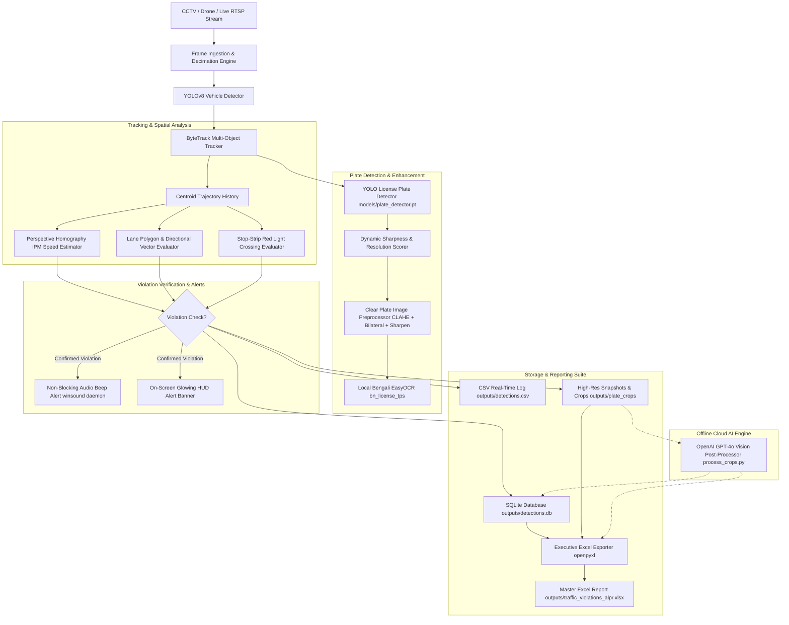

# 🚦 Bangladeshi Traffic Surveillance & Automated License Plate Recognition (ALPR) System
### Comprehensive Architecture, Features, Engineering Specifications & Setup Guide

---

## 📌 1. Executive Summary

This repository contains an enterprise-grade Computer Vision and Deep Learning traffic surveillance system engineered specifically for Bangladeshi roadway conditions. The system integrates real-time vehicle detection and multi-object tracking, specialized Bengali license plate localization and OCR, calibrated perspective homography speed estimation, directional lane discipline enforcement, red-light violation detection, and an executive evidence-reporting suite.

Key capabilities include:
- **Optical-Approach Plate Harvesting**: Preserves maximum-resolution, unblurred plate crops when vehicles reach their closest distance to the camera instead of prematurely capturing low-resolution horizon crops.
- **Deep Image Enhancement**: Employs bicubic upscaling, bilateral denoising, CLAHE contrast stretching in LAB color space, and unsharp masking.
- **Local Neural & Cloud AI OCR**: Dual-engine recognition combining a local PyTorch `bn_license_tps` EasyOCR network with an offline OpenAI GPT-4o Vision engine tailored to Bangladesh Road Transport Authority (BRTA) standards.
- **Finetuned Speed Estimation**: Perspective Inverse Perspective Mapping (IPM) homography with horizon jitter suppression ($y < 260$), median trajectory velocity calculation, and grace tolerance buffers to eliminate false-positive speeding flags.
- **Real-Time Alerting**: Non-blocking audio beeps (`winsound.Beep` on background threads) and glowing visual HUD warning banners.
- **Executive Relational Reporting**: Automated generation of master Excel workbooks containing KPI dashboard summary cards, 18 relational data columns, embedded visual image thumbnails, and direct file hyperlinks with graceful file-lock fallback recovery.
- **Host PC Clock Synchronization**: Precision timestamping referencing the operating system's real-time clock (`YYYY-MM-DD` and `HH:MM:SS`).

---

## 🏗️ 2. System Architecture & Data Flow



---

## ⚡ 3. Core Features & Engineering Implementation

### 3.1. Optical-Approach Clear Number Plate Snapshots
- **Challenge**: Vehicles entering the camera view at the top of the frame appear small ($<30\text{ px}$ wide) and blurry due to camera distance and perspective distortion.
- **Solution**: The `TrackPlateManager` maintains continuous track records across all frames. Each time a plate is localized by `models/plate_detector.pt`, the crop is evaluated using:
  1. **Bounding Box Area**: $Area = w \times h$
  2. **Laplacian Variance Sharpness**: $S = \text{Var}(\nabla^2(I))$
- **Closest Optical Distance**: The crop with the highest optical clarity and resolution is continuously retained. When the vehicle reaches the foreground ($y \ge 750$), the plate is 3–4× larger.
- **Preprocessing Pipeline** (`PlatePreprocessor.enhance_for_display`):
  - Bicubic upscaling to a standardized reading resolution ($220 \times 80\text{ px}$).
  - Bilateral filter denoising ($d=5, \sigma_{\text{color}}=40, \sigma_{\text{space}}=40$) to preserve sharp edges while smoothing camera sensor noise.
  - CLAHE (Contrast Limited Adaptive Histogram Equalization) applied to the Luminance channel ($L$) in LAB color space (`clipLimit=2.5, tileGridSize=(8,8)`).
  - Unsharp masking ($I_{\text{sharp}} = 1.4 \times I - 0.4 \times \text{GaussianBlur}(I)$) to enhance alphanumeric embossing.

### 3.2. Host PC Clock Real-Time Stamping
- Uses `datetime.datetime.now()` at the exact moment a violation or detection is confirmed.
- Stamped across all data channels:
  - SQLite: `pc_date` (`YYYY-MM-DD`), `pc_time` (`HH:MM:SS`)
  - CSV: `pc_date`, `pc_time`
  - Evidence cards: Header banner displaying `PC Time: YYYY-MM-DD HH:MM:SS`
  - Excel Report: Dedicated sortable columns `Violation Date (PC)` and `Violation Time (PC)`.

### 3.3. Dual-Engine Bengali OCR & OpenAI GPT-4o Vision Post-Processing
1. **Local Neural OCR** (`models/EasyOCR/user_network/bn_license_tps`):
   - Custom Transformation-Prediction-Sequence (TPS-ResNet-BiLSTM-CTC) architecture.
   - Character dictionary includes Bengali numerals (`০-৯`), metro names (ঢাকা, চট্টগ্রাম, সিলেট, etc.), and vehicle class characters (ক, খ, গ, ঘ, চ, ছ, জ, ঝ, ত, থ, ঢ, ড, প, ভ, ম, হ, ল).
2. **Offline OpenAI GPT-4o Vision Post-Processor** (`src/gpt_plate_reader.py`):
   - Designed for difficult, tilted, or partially shaded license plates.
   - Structured JSON prompt enforces BRTA standard syntax:
     - Metro / Region: `[City] METRO`
     - Class Letter: `[Class Letter]`
     - Number: `XX-XXXX`
   - Activated automatically via `python process_crops.py --gpt --api-key <YOUR_KEY>`.
   - Graceful fallback: If no key is provided, the pipeline logs an informational notice and preserves local OCR results without failing.

### 3.4. Finetuned Speed Estimation & Horizon Spike Rejection
- **Inverse Perspective Mapping (IPM) Homography**:
  Transforms image plane coordinates $[u, v, 1]^T$ into metric ground plane coordinates $[X, Y, 1]^T$ via homography matrix $H$:
  $$H = \text{findHomography}(P_{\text{src}}, P_{\text{dst}})$$
- **Calibrated Dimensions**:
  - Visible roadway stretch: $30.0\text{ m}$ (4 standard dashed lane dividers at 3m stripe + 6m gap).
  - Road width: $8.0\text{ m}$ (2 standard lanes).
- **Enriched Validation Logic**:
  1. **Horizon Filtering**: Detections with $y < 260$ are ignored for speed estimation. At the vanishing point, 1 pixel corresponds to $>1.5\text{ m}$, meaning 1 pixel of detection wobble produces $>80\text{ km/h}$ artificial spikes.
  2. **Median Speed Over History**: Replaces single-frame peak spikes with the median velocity across the valid measurement zone.
  3. **Minimum Travel Distance**: Requires vehicles to travel at least $4.0\text{ m}$ within the calibrated zone before speed is accepted.
  4. **Grace Tolerance Buffer**: A configurable buffer (`speed_tolerance_kmh: 5.0`) prevents false alarms near the threshold (e.g., $60 + 5 = 65\text{ km/h}$).
  5. **Normalization Fix**: Normalizes pixel displacement against the lane zone physical length.

### 3.5. Executive Relational Excel Evidence Export
- Built using `openpyxl` with an executive corporate layout:
  - **KPI Summary Cards** (Rows 2–4): Total Monitored, Violations Recorded, Compliance Rate %, Enforcement Parameters & PC Clock Generation Time.
  - **18 Relational Columns**:
    1. `Record ID` (`REC-001`)
    2. `Violation Date (PC)` (`YYYY-MM-DD`)
    3. `Violation Time (PC)` (`HH:MM:SS`)
    4. `Video Time (s)`
    5. `Video Time (MM:SS)`
    6. `Track ID`
    7. `Vehicle Class`
    8. `Violation Type`
    9. `Measured Speed`
    10. `Speed Limit`
    11. `Excess Speed`
    12. `Violation Status` (`🚨 SPEEDING`, `🚨 RED LIGHT`, `🚨 WRONG-WAY`, `✅ NORMAL`)
    13. `License Plate (Bengali)`
    14. `License Plate (English)`
    15. `Extraction Source`
    16. `Confidence`
    17. `Clear Plate Snapshot` (Embedded Image Thumbnail + Clickable Link)
    18. `Vehicle Context Snapshot` (Embedded Image Thumbnail + Clickable Link)
- **File-Lock Fallback Handler**:
  When an Excel file is open in Microsoft Excel, Windows locks the file (`PermissionError: [Errno 13]`). The exporter catches this error and automatically writes to a timestamped file (`traffic_violations_alpr_YYYYMMDD_HHMMSS.xlsx`), ensuring zero data loss.

### 3.6. Audio & Visual Notification Alerts
- **Audio Beep**: Employs Windows `winsound.Beep(frequency=1200, duration=250)` executed in a background daemon thread (`threading.Thread(target=..., daemon=True).start()`), guaranteeing zero latency or frame stutter in the video feed.
- **Visual Alert**: Draws a glowing crimson HUD banner across the top of the video feed with the violating track ID, offense type, and speed.

---

## 📂 4. Repository File Structure

```text
traffic-automation/
│
├── config.yaml                       # Master configuration (thresholds, geometry, models, alerts)
├── main.py                           # Unified CLI entry point for all modes
├── plate_speed_pipeline.py           # Core ALPR, speed monitoring & live alerting pipeline
├── process_crops.py                  # Offline high-accuracy OCR, GPT-4o Vision & Excel generator
├── pipeline.py                       # Directional lane discipline enforcement pipeline
├── traffic_light_violation.py        # Stop-strip red-light violation pipeline
├── requirements.txt                  # Python dependencies
├── cctv_footage.mp4                  # Sample 60 FPS surveillance video footage
├── reference_frame.jpg               # Geometry reference frame for polygon calibration
├── SYSTEM_ARCHITECTURE_AND_SETUP.md  # Complete engineering architecture & setup guide
├── README.md                         # Quick-start documentation
│
├── models/
│   ├── plate_detector.pt             # Trained YOLO license plate detector (22.5 MB)
│   └── EasyOCR/
│       ├── models/
│       │   └── bn_license_tps.pth    # Bengali license plate recognition weights (83.8 MB)
│       └── user_network/
│           ├── bn_license_tps.py     # PyTorch custom neural network architecture
│           ├── bn_license_tps.yaml   # Architecture configuration and character set
│           └── modules/              # TPS feature extraction, sequence modeling & prediction
│
├── src/
│   ├── __init__.py
│   ├── excel_exporter.py             # Executive openpyxl workbook generator with embedded images
│   ├── gpt_plate_reader.py           # OpenAI GPT-4o Vision client with BRTA schema parsing
│   ├── motion_tracker.py             # Centroid trajectory history & smoothing
│   ├── plate_detector.py             # Plate preprocessing, tracking & local EasyOCR engine
│   ├── speed_estimator.py            # Calibrated perspective homography IPM speed estimator
│   ├── tracker.py                    # YOLOv8 vehicle detector & ByteTrack multi-object tracker
│   ├── utils.py                      # Frame decimation ingester, bilingual text rendering & HUD
│   ├── violation_detector.py         # Lane discipline vector & progress violation logic
│   └── violation_reporter.py         # Evidence composite card generator, CSV & SQLite logging
│
└── outputs/                          # (Generated during execution)
    ├── annotated_plate_speed.mp4     # Annotated surveillance video output
    ├── traffic_violations_alpr.xlsx  # Master executive Excel report with embedded images
    ├── detections.db                 # Relational SQLite database
    ├── detections.csv                # Real-time CSV detection log
    ├── plate_crops/                  # Highest-resolution enhanced license plate snapshots
    └── plate_snapshots/              # Full vehicle context evidence cards with zoomed insets
```

---

## 🛠️ 5. Prerequisites & Environment Setup

### 5.1. System Requirements
- **Operating System**: Windows 10/11, Ubuntu 20.04+, or macOS
- **Python**: Version 3.10 to 3.13
- **Hardware**:
  - *CPU*: Intel Core i5/i7/i9 or AMD Ryzen (runs smoothly with frame decimation)
  - *GPU* (Optional): NVIDIA GPU with CUDA 11.8 / 12.1 for accelerated inference

### 5.2. Step-by-Step Installation

#### Step 1: Clone the Repository
```bash
git clone https://github.com/<your-username>/traffic-automation.git
cd traffic-automation
```

#### Step 2: Create a Virtual Environment
```powershell
# Using Python venv
python -m venv venv
.\venv\Scripts\Activate.ps1

# Or using Conda
conda create -n traffic python=3.11 -y
conda activate traffic
```

#### Step 3: Install PyTorch
- **For CPU Only**:
  ```bash
  pip install torch torchvision --index-url https://download.pytorch.org/whl/cpu
  ```
- **For NVIDIA GPU (CUDA 12.1)**:
  ```bash
  pip install torch torchvision --index-url https://download.pytorch.org/whl/cu121
  ```

#### Step 4: Install Dependencies
```bash
pip install -r requirements.txt
```

#### Step 5: Verify Model Weights
Ensure the following model weight files are present in the `models/` directory:
- `models/plate_detector.pt` (Trained YOLO license plate detector)
- `models/EasyOCR/models/bn_license_tps.pth` (Bengali OCR weights)
- `yolov8n.pt` (Base vehicle detection weights — automatically downloaded on first run)

---

## ⚙️ 6. Configuration Guide (`config.yaml`)

| Section | Parameter | Default | Description |
|---|---|---|---|
| **input** | `source` | `cctv_footage.mp4` | Path to video file, webcam index (`0`), or RTSP stream |
| | `frame_decimation` | `5` | Process 1 out of every N frames (e.g., 60 FPS $\rightarrow$ 12 FPS) |
| **speed** | `speed_limit_kmh` | `60.0` | Base roadway speed limit |
| | `speed_tolerance_kmh` | `5.0` | Grace tolerance buffer before triggering violation (65 km/h) |
| | `min_measurement_y` | `260` | Horizon cutoff line; ignores pixel jitter above this $y$-coordinate |
| | `min_track_frames` | `8` | Minimum frames a track must be observed before evaluating speed |
| | `min_sustained_frames` | `6` | Minimum sustained readings above limit to confirm speeding |
| | `ground_width_meters` | `8.0` | Physical roadway width in meters (2 lanes) |
| | `ground_length_meters` | `30.0` | Physical length of visible road stretch between IPM points |
| **alerts** | `beep_enabled` | `true` | Enable non-blocking audio beep on violation |
| | `beep_frequency_hz` | `1200` | Beep pitch frequency |
| | `beep_duration_ms` | `250` | Beep duration in milliseconds |
| **ai** | `openai_api_key` | `""` | OpenAI API Key for GPT-4o Vision post-processing |
| | `gpt_model` | `gpt-4o-mini` | Model name (`gpt-4o-mini` or `gpt-4o`) |
| **display** | `show_window` | `true` | Show live preview window during processing |
| | `window_width` | `1280` | Preview window width |
| | `window_height` | `720` | Preview window height |

---

## 🚀 7. Execution & CLI Usage Reference

### 7.1. Mode 1: Primary ALPR & Speed Monitoring (Default)
Runs vehicle detection, tracking, license plate localization, Bengali OCR, speed enforcement, audio beeps, and exports the master Excel workbook.

```bash
# Run with live preview window
python main.py

# Run on a custom video footage
python main.py path/to/surveillance_video.mp4

# Run in headless mode (no GUI window)
python main.py --no-display

# Test only the first 500 frames
python main.py --max-frames 500 --no-display
```

### 7.2. Mode 2: Lane Discipline & Wrong-Way Enforcement
Enforces lane boundaries, forbidden lane transitions, and wrong-way travel.

```bash
python main.py --mode lane
```

### 7.3. Mode 3: Traffic Light & Stop-Strip Violation
Detects vehicles crossing the stop-strip during a red light.

```bash
python main.py --mode traffic_light
```

### 7.4. Mode 4: Offline High-Accuracy AI Post-Processing & Excel Export
Processes harvested clear plate snapshots (`outputs/plate_crops/`) using deep OCR or OpenAI GPT-4o Vision and generates the executive Excel report.

```bash
# 1. Run local neural OCR post-processing & Excel generation
python process_crops.py

# 2. Run with OpenAI GPT-4o Vision (passing API key via CLI)
python process_crops.py --gpt --api-key "sk-..."

# 3. Run with OpenAI GPT-4o Vision (using environment variable)
set OPENAI_API_KEY="sk-..."       # Windows CMD
$env:OPENAI_API_KEY="sk-..."     # Windows PowerShell
export OPENAI_API_KEY="sk-..."   # Linux / macOS
python process_crops.py --gpt
```

---

## 📊 8. Database & Data Output Schema

### 8.1. SQLite Database Schema (`outputs/detections.db`)
```sql
CREATE TABLE IF NOT EXISTS detections (
    id INTEGER PRIMARY KEY AUTOINCREMENT,
    timestamp_sec REAL,
    pc_date TEXT,               -- Host PC Date (YYYY-MM-DD)
    pc_time TEXT,               -- Host PC Time (HH:MM:SS)
    track_id INTEGER,
    plate_bn TEXT,              -- Bengali License Plate Text
    plate_en TEXT,              -- English Transliterated Plate Text
    confidence REAL,            -- OCR Confidence Score (0.0 - 1.0)
    speed_kmh REAL,             -- Calibrated Travel Speed
    peak_speed_kmh REAL,        -- Peak Velocity
    is_speeding INTEGER,        -- 1 if speeding, 0 if compliant
    plate_crop_path TEXT,       -- Path to clearest enhanced plate crop
    snapshot_path TEXT          -- Path to vehicle context evidence card
);
```

### 8.2. CSV Detection Log Schema (`outputs/detections.csv`)
`timestamp_sec, pc_date, pc_time, track_id, plate_bn, plate_en, confidence, speed_kmh, peak_speed_kmh, is_speeding, bbox, snapshot_path`

---

## ❓ 9. Troubleshooting & Common Questions

#### Q1: "Permission denied: outputs\traffic_violations_alpr.xlsx"
- **Cause**: The Excel file is open in Microsoft Excel on Windows, which locks the file against write access.
- **Resolution**: The system automatically detects this and saves the report to a fallback timestamped file (e.g., `outputs/traffic_violations_alpr_YYYYMMDD_HHMMSS.xlsx`). Close the file in Excel if you wish to overwrite the default filename.

#### Q2: Vehicles driving at normal speed are flagged as speeding
- **Cause**: Ground homography dimensions or horizon perspective compression.
- **Resolution**: Adjust `config.yaml`:
  - Increase `ground_length_meters` if distances are underestimated.
  - Ensure `min_measurement_y: 260` to ignore perspective jitter near the horizon.
  - Adjust `speed_tolerance_kmh: 5.0` to set a suitable grace buffer.

#### Q3: "Using CPU. Note: This module is much faster with a GPU."
- **Cause**: PyTorch is using the CPU.
- **Resolution**: The system runs stably on CPU due to frame decimation (`frame_decimation: 5`). For GPU acceleration, install the CUDA-enabled PyTorch build:
  ```bash
  pip install torch torchvision --index-url https://download.pytorch.org/whl/cu121
  ```

---

## 📄 License & Attribution
Developed for intelligent transportation monitoring and computer vision research in Bangladesh. Licensed under the MIT License.
