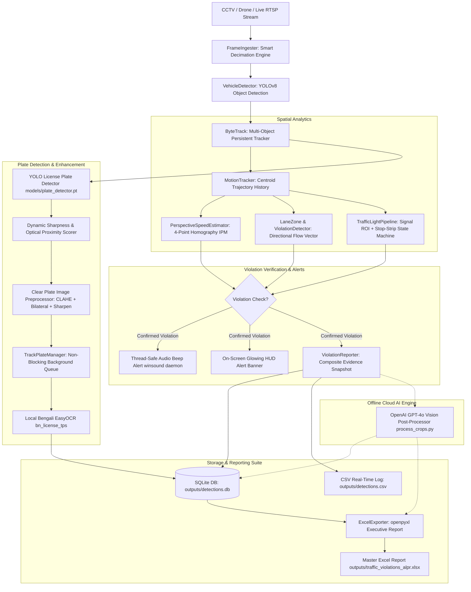

# 🚦 Bangladeshi Traffic Surveillance & Automated License Plate Recognition (ALPR) System
### Comprehensive Architecture, Features, Engineering Specifications & Setup Guide

---

## 📌 1. Executive Summary

This repository contains an enterprise-grade Computer Vision and Deep Learning traffic surveillance system engineered specifically for Bangladeshi roadway conditions. The system integrates real-time vehicle detection and multi-object tracking, specialized Bengali license plate localization and OCR, calibrated perspective homography speed estimation, directional lane discipline enforcement, red-light violation detection, and an executive evidence-reporting suite.

Key capabilities include:
- **Unified Multi-Task Orchestration**: Centralized orchestrator [main.py](file:///d:/traffic-automation/main.py) manages all tasks (`all`, `lane`, `speed`, `plate`, `traffic_light`, `excel`), while preserving independent standalone scripts for modular microservice deployments.
- **Optical-Approach Plate Harvesting**: Preserves maximum-resolution, unblurred plate crops when vehicles reach their closest optical distance to the camera instead of prematurely capturing low-resolution horizon crops.
- **Deep Image Enhancement**: Employs bicubic upscaling, bilateral denoising, CLAHE contrast stretching in LAB color space, and unsharp masking.
- **Local Neural & Cloud AI OCR**: Dual-engine recognition combining a local PyTorch `bn_license_tps` EasyOCR network with an offline OpenAI GPT-4o Vision engine tailored to Bangladesh Road Transport Authority (BRTA) standards.
- **Calibrated Speed Estimation**: Perspective Inverse Perspective Mapping (IPM) homography with horizon jitter suppression ($y < 260$), median trajectory velocity calculation, and grace tolerance buffers to eliminate false-positive speeding flags.
- **Dynamic Resolution Auto-Scaling**: Geometry points and polygons defined on reference frames automatically scale to ingested camera resolutions (720p, 1080p, 4K).
- **Real-Time Alerting**: Non-blocking audio beeps (`winsound.Beep` on background threads on Windows, terminal bell fallback on Linux) and glowing visual HUD warning banners.
- **Executive Relational Reporting**: Automated generation of master Excel workbooks containing KPI dashboard summary cards, 18 relational data columns, embedded visual image thumbnails, and direct file hyperlinks with graceful file-lock fallback recovery.
- **Host PC Clock Synchronization**: Precision timestamping referencing the operating system's real-time clock (`YYYY-MM-DD` and `HH:MM:SS`).

---

## 🏗️ 2. System Architecture & Data Flow



---

## ⚡ 3. Core Features & Engineering Implementation

### 3.1. Optical-Approach Clear Number Plate Snapshots
- **Challenge**: Vehicles entering the camera view at the top of the frame appear small ($<30\text{ px}$ wide) and blurry due to camera distance and perspective distortion.
- **Solution**: The [TrackPlateManager](file:///d:/traffic-automation/src/plate_detector.py#L484) maintains continuous track records across all frames. Each time a plate is localized by `models/plate_detector.pt`, the crop is evaluated using:
  1. **Bounding Box Area**: $Area = w \times h$
  2. **Laplacian Variance Sharpness**: $S = \text{Var}(\nabla^2(I))$
- **Closest Optical Distance**: The crop with the highest optical clarity and resolution is continuously retained. When the vehicle reaches the foreground ($y \ge 750$), the plate is 3–4× larger.
- **Preprocessing Pipeline** (`PlatePreprocessor.enhance_for_display`):
  - Dynamic bicubic upscaling to a standardized reading resolution ($220 \times 80\text{ px}$ or $300 \times 120\text{ px}$).
  - Bilateral filter denoising ($d=5, \sigma_{\text{color}}=40, \sigma_{\text{space}}=40$) to preserve sharp edges while smoothing camera sensor noise.
  - CLAHE (Contrast Limited Adaptive Histogram Equalization) applied to the Luminance channel ($L$) in LAB color space (`clipLimit=2.5, tileGridSize=(8,8)`).
  - Unsharp masking ($I_{\text{sharp}} = 1.4 \times I - 0.4 \times \text{GaussianBlur}(I)$) to enhance alphanumeric embossing.

### 3.2. Host PC Clock Real-Time Stamping
- Uses `datetime.datetime.now()` at the exact moment a violation or detection is confirmed.
- Stamped across all data channels:
  - SQLite: `pc_date` (`YYYY-MM-DD`), `pc_time` (`HH:MM:SS`)
  - CSV: `pc_date`, `pc_time`
  - Evidence cards: Header banner displaying `PC Time: YYYY-MM-DD HH:MM:SS`
  - Excel Report: Dedicated sortable columns `Violation Date (PC)` and `Violation Time (PC)`.

### 3.3. Dual-Engine Bengali OCR & OpenAI GPT-4o Vision Post-Processing
1. **Local Neural OCR** (`models/EasyOCR/user_network/bn_license_tps`):
   - Custom Transformation-Prediction-Sequence (TPS-ResNet-BiLSTM-CTC) architecture.
   - Character dictionary includes Bengali numerals (`০-৯`), metro names (ঢাকা, চট্টগ্রাম, সিলেট, etc.), and vehicle class characters (ক, খ, গ, ঘ, চ, ছ, জ, ঝ, ত, থ, ঢ, ড, প, ভ, ম, হ, ল).
   - Seamless fallback: If custom network weights are not found, falls back automatically to standard EasyOCR Bengali reader (`~/.EasyOCR/model/bengali.pth`).
2. **Offline OpenAI GPT-4o Vision Post-Processor** (`src/gpt_plate_reader.py`):
   - Designed for difficult, tilted, or partially shaded license plates.
   - Structured JSON prompt enforces BRTA standard syntax:
     - Metro / Region: `[City] METRO`
     - Class Letter: `[Class Letter]`
     - Number: `XX-XXXX`
   - Activated automatically via `python main.py --mode excel` or `python process_crops.py`.
   - Graceful offline fallback: Passing `--no-gpt` runs full local OCR and Excel export with zero external API calls.

### 3.4. Calibrated Speed Estimation & Horizon Spike Rejection
- **Inverse Perspective Mapping (IPM) Homography**:
  Transforms image plane coordinates $[u, v, 1]^T$ into metric ground plane coordinates $[X, Y, 1]^T$ via homography matrix $H$:
  $$H = \text{findHomography}(P_{\text{src}}, P_{\text{dst}})$$
- **Calibrated Dimensions**:
  - Visible roadway stretch: $30.0\text{ m}$ (4 standard dashed lane dividers at 3m stripe + 6m gap).
  - Road width: $8.0\text{ m}$ (2 standard lanes).
- **Validation Logic**:
  1. **Horizon Filtering**: Detections with $y < 260$ are ignored for speed estimation. At the vanishing point, 1 pixel corresponds to $>1.5\text{ m}$, meaning 1 pixel of detection wobble produces $>80\text{ km/h}$ artificial spikes.
  2. **Median Speed Over History**: Replaces single-frame peak spikes with the rolling median velocity across the valid measurement zone.
  3. **Minimum Travel Distance**: Requires vehicles to travel at least $4.0\text{ m}$ within the calibrated zone before speed is accepted.
  4. **Grace Tolerance Buffer**: A configurable buffer (`speed_tolerance_kmh: 5.0`) prevents false alarms near the threshold (e.g., $60 + 5 = 65\text{ km/h}$).
  5. **Dynamic Resolution Auto-Scaling**: Scales calibration polygon coordinates if the video resolution differs from `reference_resolution: [2046, 1080]`.

### 3.5. Directional Lane Discipline & Wrong-Way Enforcement
- **LaneZone Polygon**: 4-point convex quadrilateral with points ordered:
  - $P_1$: Exit Left, $P_2$: Exit Right, $P_3$: Entry Right, $P_4$: Entry Left.
- **Flow Vector**: Legal direction unit vector $\vec{u}_{\text{legal}}$ points from entry midpoint to exit midpoint.
- **Infraction Logic**:
  - **Opposite Direction**: Cosine similarity $\frac{\vec{v} \cdot \vec{u}_{\text{legal}}}{\|\vec{v}\| \|\vec{u}_{\text{legal}}\|} < -0.2$.
  - **Forbidden Exit Entry**: Flags vehicles entering the zone through the exit boundary line ($P_1 \to P_2$).

### 3.6. Traffic Light Stop-Strip Violation
- **Signal ROI Color Classifier**:
  - Defines polygon ROI over signal head (`traffic_light.light_box_points`).
  - Converts ROI to HSV color space and applies red, yellow, and green chrominance masks.
  - Dominant color ratio determines active signal phase.
- **Stop-Strip Intersection State Machine**:
  - Stop line is dilated by `strip_half_width` (default 34 px) into a polygonal strip.
  - Vehicle bounding-box bottom center anchor is tracked across frames.
  - If a vehicle enters or traverses the strip during a **RED** signal phase, a red-light violation is instantly logged.

### 3.7. Executive Relational Excel Evidence Export
- Built using `openpyxl` with an executive corporate layout:
  - **KPI Summary Cards** (Rows 2–4): Total Vehicles Monitored, Speed Violations, Lane Violations, Red Light Violations, Compliance Rate %, and Generation Timestamp.
  - **18 Relational Columns**:
    1. `Record ID` (`REC-001`)
    2. `Violation Date (PC)` (`YYYY-MM-DD`)
    3. `Violation Time (PC)` (`HH:MM:SS`)
    4. `Video Time (s)`
    5. `Video Time (MM:SS)`
    6. `Track ID`
    7. `Vehicle Class`
    8. `Violation Type`
    9. `Measured Speed`
    10. `Speed Limit`
    11. `Excess Speed`
    12. `Violation Status` (`🚨 SPEEDING`, `🚨 RED LIGHT`, `🚨 WRONG-WAY`, `✅ NORMAL`)
    13. `License Plate (Bengali)`
    14. `License Plate (English)`
    15. `Extraction Source`
    16. `Confidence`
    17. `Clear Plate Snapshot` (Embedded Image Thumbnail + Clickable Link)
    18. `Vehicle Context Snapshot` (Embedded Image Thumbnail + Clickable Link)
- **File-Lock Fallback Handler**:
  When an Excel file is open in Microsoft Excel, Windows locks the file (`PermissionError: [Errno 13]`). The exporter catches this error and automatically writes to a timestamped file (`traffic_violations_alpr_YYYYMMDD_HHMMSS.xlsx`), ensuring zero data loss.

### 3.8. Audio & Visual Notification Alerts
- **Audio Beep**: Employs non-blocking, thread-safe [trigger_beep](file:///d:/traffic-automation/src/utils.py#L18) executed in a background daemon thread with debouncing. Native `winsound.Beep(1200, 250)` on Windows, terminal bell fallback on Linux.
- **Visual Alert**: Draws a glowing crimson HUD banner across the top of the video feed with the violating track ID, offense type, and speed.

---

## 📂 4. Repository File Structure

```text
traffic-automation/
│
├── config.yaml                       # Master configuration (thresholds, geometry, models, alerts)
├── main.py                           # Master CLI orchestrator (runs any or all modes)
├── plate_speed_pipeline.py           # Core ALPR, speed monitoring & live alerting pipeline
├── wrong_lane_violation.py           # Dedicated standalone lane & wrong-way violation pipeline
├── speed_violation.py                # Dedicated standalone IPM speed estimation pipeline
├── license_plate_capture.py          # Dedicated standalone plate detector & harvester
├── traffic_light_violation.py        # Dedicated standalone red-light stop-line pipeline
├── process_crops.py                  # Offline multi-scale plate OCR & GPT-4o post-processor
├── export_excel.py                   # Standalone Excel audit workbook generator
├── pipeline.py                       # Backward-compatibility alias for lane violation pipeline
├── requirements.txt                  # Python dependencies
├── cctv_footage.mp4                  # Primary benchmark CCTV footage (2046x1080 @ 60 FPS)
├── light_cut.mp4                     # Traffic light benchmark footage (1920x1080 @ 30 FPS)
├── reference_frame.jpg               # Geometry reference frame for polygon calibration
├── SYSTEM_ARCHITECTURE_AND_SETUP.md  # Complete engineering architecture & setup guide
├── README.md                         # Quick-start developer guide & reference
│
├── models/
│   ├── plate_detector.pt             # Trained YOLO license plate detector (6.2 MB)
│   └── EasyOCR/
│       └── user_network/
│           ├── bn_license_tps.py     # PyTorch custom neural network architecture
│           ├── bn_license_tps.yaml   # Architecture configuration and character set
│           └── modules/              # TPS feature extraction, sequence modeling & prediction
│
├── src/
│   ├── __init__.py
│   ├── excel_exporter.py             # Executive openpyxl workbook generator with embedded images
│   ├── gpt_plate_reader.py           # OpenAI GPT-4o Vision client with BRTA schema parsing
│   ├── lane_zone.py                  # 4-point lane polygon geometry & resolution scaling
│   ├── motion_tracker.py             # Centroid trajectory history & smoothing
│   ├── plate_detector.py             # LicensePlateDetector, BanglaPlateOCR, TrackPlateManager
│   ├── speed_estimator.py            # Calibrated perspective homography IPM speed estimator
│   ├── tracker.py                    # YOLOv8 vehicle detector & ByteTrack multi-object tracker
│   ├── utils.py                      # Frame decimation ingester, bilingual text rendering & HUD
│   ├── violation_detector.py         # Lane discipline vector & progress violation logic
│   └── violation_reporter.py         # Evidence composite card generator, CSV & SQLite logging
│
└── outputs/                          # (Generated during execution)
    ├── annotated_plate_speed.mp4     # Annotated surveillance video output
    ├── traffic_violations_alpr.xlsx  # Master executive Excel report with embedded images
    ├── detections.db                 # Relational SQLite database (15-column schema)
    ├── detections.csv                # Real-time CSV detection log
    ├── plate_crops/                  # Highest-resolution enhanced license plate snapshots
    └── snapshots/                    # Full vehicle context evidence cards with zoomed insets
```

---

## 🛠️ 5. Prerequisites & Environment Setup

### 5.1. System Requirements
- **Operating System**: Windows 10/11, Ubuntu 20.04+, or macOS
- **Python**: Version 3.10 or higher
- **Hardware**:
  - *CPU*: Intel Core i5/i7/i9 or AMD Ryzen (runs smoothly with frame decimation)
  - *GPU* (Optional): NVIDIA GPU with CUDA 11.8 / 12.1 for accelerated inference

### 5.2. Step-by-Step Installation

#### Step 1: Clone the Repository
```bash
git clone https://github.com/<your-username>/traffic-automation.git
cd traffic-automation
```

#### Step 2: Create a Virtual Environment
```powershell
# Using Python venv
python -m venv .venv

# On Windows (PowerShell):
.\.venv\Scripts\Activate.ps1

# On Windows (Command Prompt):
.\.venv\Scripts\activate.bat

# On Linux / macOS:
source .venv/bin/activate
```

#### Step 3: Install Dependencies
```bash
pip install -r requirements.txt
```

#### Step 4: Optional OpenAI Package
For multimodal GPT-4o Vision reasoning on degraded plates:
```bash
pip install openai
```

#### Step 5: Verify Model Weights & OCR
- `yolov8n.pt`: Base vehicle detector (auto-downloaded on first run if absent).
- `models/plate_detector.pt`: Specialized Bangladeshi plate detection weights.
- `EasyOCR`: On initial run, EasyOCR downloads base models into `~/.EasyOCR/model/` (`bengali.pth`, `craft_mlt_25k.pth`). If custom weights in `models/EasyOCR/models/` are provided, the system loads the specialized `bn_license_tps` network.

---

## ⚙️ 6. Configuration Guide (`config.yaml`)

| Section | Parameter | Default | Description |
|---|---|---|---|
| **input** | `source` | `cctv_footage.mp4` | Video file, webcam index (`0`), or RTSP stream |
| | `frame_decimation` | `"auto"` | Automatic decimation targeting `target_process_fps` |
| | `target_process_fps` | `15` | Effective processing rate for ByteTrack stability |
| **vehicle_detection** | `confidence_threshold` | `0.35` | Minimum YOLO confidence for vehicle detection |
| | `target_classes` | `[2, 3, 5, 7]` | COCO classes: car (2), motorcycle (3), bus (5), truck (7) |
| **speed** | `reference_resolution` | `[2046, 1080]` | Resolution against which `source_polygon` was defined |
| | `speed_limit_kmh` | `60.0` | Base roadway speed limit |
| | `speed_tolerance_kmh` | `5.0` | Grace tolerance buffer before triggering violation (65 km/h) |
| | `min_measurement_y` | `260` | Horizon cutoff line; ignores pixel jitter above this $y$-coordinate |
| | `min_track_frames` | `8` | Minimum frames a track must be observed before evaluating speed |
| | `min_sustained_frames` | `6` | Minimum sustained readings above limit to confirm speeding |
| | `ground_width_meters` | `8.0` | Physical roadway width in meters (2 lanes) |
| | `ground_length_meters` | `30.0` | Physical length of visible road stretch between IPM points |
| **lane_zone** | `reference_resolution` | `[2046, 1080]` | Resolution against which lane points were calibrated |
| | `points` | `[[280,950],...]` | 4 quadrilateral points ($P_1..P_4$) defining directional lane |
| **traffic_light** | `reference_resolution` | `[1280, 720]` | Reference resolution for signal box and stop line |
| | `strip_half_width` | `34` | Pixel half-width of dilated stop-strip zone |
| | `light_box_points` | `[[764,41],...]` | Polygon ROI covering traffic signal head |
| | `signal_line_points`| `[[1150,390],...]`| Pixel endpoints of road stop line |
| **alerts** | `beep_enabled` | `true` | Enable non-blocking audio beep on violation |
| | `beep_frequency_hz` | `1200` | Beep pitch frequency |
| | `beep_duration_ms` | `250` | Beep duration in milliseconds |
| **ai** | `openai_api_key` | `""` | OpenAI API Key for GPT-4o Vision post-processing |
| | `gpt_model` | `gpt-4o-mini` | Model name (`gpt-4o-mini` or `gpt-4o`) |
| **display** | `show_window` | `true` | Show live preview window during processing |
| | `window_width` | `1280` | Preview window width |
| | `window_height` | `720` | Preview window height |

---

## 🚀 7. Execution & CLI Usage Reference

### 7.1. Master CLI Orchestrator (`main.py`)

[main.py](file:///d:/traffic-automation/main.py) is the master entry point with full CLI override support:

```bash
# 1. Master Unified Pipeline (Speed + Lane + ALPR + Auto-Excel)
python main.py --mode all

# 2. Custom Video & Headless Server Mode
python main.py path/to/video.mp4 --mode all --no-display

# 3. Dedicated Wrong-Lane / Wrong-Way Mode
python main.py cctv_footage.mp4 --mode lane

# 4. Dedicated IPM Speed Violation Mode
python main.py cctv_footage.mp4 --mode speed

# 5. Dedicated Plate Capture & ALPR Mode
python main.py cctv_footage.mp4 --mode plate

# 6. Dedicated Traffic Light Stop-Strip Mode
python main.py light_cut.mp4 --mode traffic_light

# 7. Excel Report Generation (Offline Local EasyOCR)
python main.py --mode excel --no-gpt

# 8. Excel Report Generation (OpenAI GPT-4o Vision)
python main.py --mode excel
```

### 7.2. Standalone Subtask Scripts

Every subtask can also be executed directly:

```bash
# Dedicated Lane Discipline Pipeline
python wrong_lane_violation.py cctv_footage.mp4

# Dedicated Speed Violation Pipeline
python speed_violation.py cctv_footage.mp4

# Dedicated License Plate Capture Pipeline
python license_plate_capture.py cctv_footage.mp4

# Dedicated Traffic Light Violation Pipeline
python traffic_light_violation.py light_cut.mp4

# Standalone Excel Exporter (Offline)
python export_excel.py --no-gpt

# Offline OCR Post-Processing Engine
python process_crops.py --no-gpt
```

---

## 📊 8. Database & Data Output Schema

### 8.1. Relational SQLite Database Schema (`outputs/detections.db`)
All pipelines write to the standardized 15-column `detections` table:

```sql
CREATE TABLE IF NOT EXISTS detections (
    id               INTEGER PRIMARY KEY AUTOINCREMENT,
    pc_date          TEXT,     -- Host PC Date (YYYY-MM-DD)
    pc_time          TEXT,     -- Host PC Clock Time (HH:MM:SS)
    timestamp_sec    REAL,     -- Video presentation timestamp (seconds)
    frame_idx        INTEGER,  -- Video frame index
    track_id         INTEGER,  -- ByteTrack persistent vehicle identifier
    plate_bn         TEXT,     -- BRTA Bengali License Plate String
    plate_en         TEXT,     -- Standardized English Transliteration
    plate_conf       REAL,     -- OCR Character Confidence Score (0.0 to 1.0)
    speed_kmh        REAL,     -- Calibrated Vehicle Speed (km/h)
    peak_speed_kmh   REAL,     -- Maximum Speed in Measurement Zone (km/h)
    speeding         INTEGER,  -- Boolean (1 = Speeding Violation, 0 = Normal)
    lane_violation   TEXT,     -- Lane Violation Reason ("opposite_direction", etc.)
    violation_type   TEXT,     -- Violation Label ("SPEED", "WRONG-WAY", "RED-LIGHT")
    plate_crop_path  TEXT,     -- File Path to Enhanced Plate Crop
    snapshot_path    TEXT      -- File Path to Full Evidence Snapshot Card
);
```

### 8.2. CSV Detection Log Schema (`outputs/detections.csv`)
Append-mode CSV log with headers:
```text
pc_date, pc_time, timestamp_sec, frame_idx, track_id, plate_bn, plate_en, plate_conf, speed_kmh, peak_speed_kmh, speeding, lane_violation, violation_type, plate_crop_path, snapshot_path
```

---

## ❓ 9. Troubleshooting & Developer FAQ

#### Q1: "Permission denied: outputs\traffic_violations_alpr.xlsx"
- **Cause**: The Excel file is open in Microsoft Excel on Windows, locking write access.
- **Resolution**: The system automatically detects this and writes to a timestamped file (`outputs/traffic_violations_alpr_YYYYMMDD_HHMMSS.xlsx`). Close Excel if you wish to overwrite the default filename.

#### Q2: Video playback is freezing or stuttering (laggy FPS).
- **Cause**: CCTV feeds at 60 FPS without frame decimation saturate CPU/GPU resources.
- **Resolution**: Use `input.frame_decimation: "auto"` (or pass `--decimation 4`), and run headless via `--no-display` when deploying to production servers.

#### Q3: Bengali text appears as question marks or squares on Windows.
- **Cause**: Windows CMD/PowerShell default codepage is not UTF-8.
- **Resolution**: Run `chcp 65001` before launching the script. The codebase already configures `sys.stdout.reconfigure(encoding='utf-8')` to prevent encoding crashes.

#### Q4: Vehicles driving at normal speed are flagged as speeding.
- **Cause**: Perspective distortion or homography stretch mismatch.
- **Resolution**: In [config.yaml](file:///d:/traffic-automation/config.yaml):
  - Ensure `min_measurement_y: 260` is set to ignore perspective compression near the horizon.
  - Adjust `speed_tolerance_kmh: 5.0` to configure the grace buffer.
  - Recalibrate `ground_length_meters` to match the exact measured distance between `source_polygon` points.

#### Q5: "Using CPU. Note: This module is much faster with a GPU."
- **Cause**: PyTorch is using the CPU.
- **Resolution**: The system runs reliably on CPU thanks to smart frame decimation. For GPU acceleration:
  ```bash
  pip install torch torchvision --index-url https://download.pytorch.org/whl/cu121
  ```

---

## 📄 License & Attribution
Developed for intelligent transportation monitoring and computer vision research in Bangladesh. Licensed under the MIT License.
